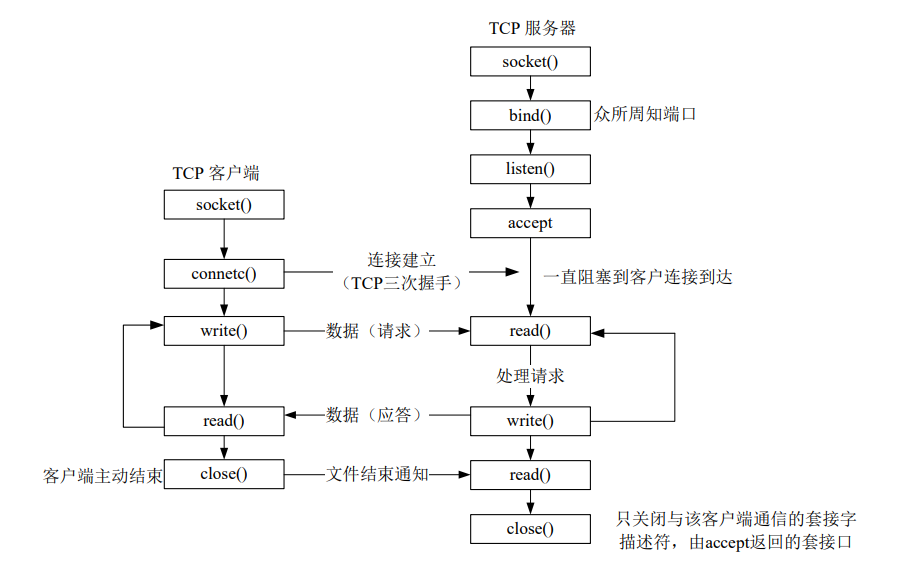

# 字符串大小写转换服务

## Feature

+ 设计了应用层协议
+ 提供 CLI 交互
+ Makefile 项目管理
+ C/S 密钥验证
+ 服务端具有客户端管理能力


## 原理

基于 Linux 的 Socket 接口搭建的字符串大小写转换服务



[大概像这样的连接流程图]


加入了密钥验证阶段. 

1. 密钥验证

   客户端连接服务端时, 首先按发送一个含有连接密码(明文, 可改为带加密)的数据包. 交由服务端验证连接密码是否正确. 若正确, 则允许客户端连接; 若错误, 则拒绝客户端连接

2. 数据传送

   客户端发送 Request 数据包, 服务端解析处理后发挥 Response 数据包. 


## 应用层协议设计

[协议结构体设计]

```c
typedef struct myproto_hdr
{
    uint8_t     type;           // 1: request, 2: response
    long long   timestamp;      // milliseconds
    char        flag[256];      // system flag
    char        msg[256];       // message
} proto_hdr;
```

```
+-------+----------------------------------------------------+
| Field | Value                                              |
+-------+----------------------------------------------------+
| TYP   | 2                                                  |
| TIM   | 2023-11-18 18:00:17:340 (1700301617340)            |
| FLG   | DESKTOP-ZENOR0 5.15.133.1-microsoft-standard-WSL2  |
| MSG   | Server accepted!                                   |
+-------+----------------------------------------------------+
```

| 字段        | 类型        | 含义                                   |
| ----------- | ----------- | -------------------------------------- |
| `type`      | `uint8_t`   | 表示消息的类型。1表示请求，2表示响应。 |
| `timestamp` | `long long` | 表示消息的时间戳，以毫秒为单位。       |
| `flag`      | `char[256]` | 包含与消息相关的系统标志或信息。       |
| `msg`       | `char[256]` | 表示协议的主要内容或消息。             |

这个结构体定义了一个简单的协议头，包含有关消息类型（请求或响应）、时间戳、与系统相关的标志以及协议主要内容的信息。使用固定大小的数组（`flag`和`msg`）表明这些字段有最大长度限制。


## CLI 交互

### 服务端 CLI 指令

| 命令     | 注释                 |
| -------- | -------------------- |
| \exit    | 退出程序。           |
| \clients | 显示客户端列表。     |
| \reset   | 断开所有客户端连接。 |
| \help    | 显示此帮助消息。     |


### 客户端 CLI 指令

| 命令  | 解释             |
| ----- | ---------------- |
| \exit | 退出程序         |
| \help | 显示此帮助消息。 |


## Makefile 项目管理

本项目使用了 Makefile 进行项目管理, 以下是关于这个 makefile 的说明

这个Makefile看起来是用于编译和运行一个简单的服务器-客户端程序，同时包含了设置和取消网络延迟的功能。以下是一个简要的使用说明文档：

### 编译和运行服务器

要编译和运行服务器，可以执行以下命令：

```bash
make server
```

这将编译`server.c`，`msg.c`和`myproto.c`文件，并生成可执行文件`server`。然后，它会运行`server`程序，监听在端口12345上。

### 编译和运行客户端

要编译和运行客户端，可以执行以下命令：

```bash
make client
```

这将编译`client.c`，`msg.c`和`myproto.c`文件，并生成可执行文件`client`。然后，它会运行`client`程序，连接到本地IP地址127.0.0.1和端口12345，并传递默认密码`zenor0`。

### 设置网络延迟

如果需要模拟网络延迟，可以使用以下命令设置延迟：

```bash
make set-delay
```

这将使用`tc`命令在本地网络接口上添加延迟规则，模拟延迟为100ms，20ms的标准差。

### 取消网络延迟

要取消网络延迟模拟，可以执行以下命令：

```bash
make unset-delay
```

这将删除之前设置的网络延迟规则。

### 清理生成的文件

为了清理生成的可执行文件和中间目标文件，可以执行以下命令：

```bash
make clean
```

这将删除所有`.o`文件以及`server`和`client`可执行文件。


## examples

服务端管理客户端连接

```
+-------+----------------------+
| fd    | Client IP            |
+-------+----------------------+
| 4     | 127.0.0.1:40210      |
| 5     | 127.0.0.1:40212      |
+-------+----------------------+
2023-11-18 18:27:13 |  [INFO] 2 clients in total.
\reset
2023-11-18 18:27:17 | [DEBUG] Client 4 has been disconnected.
2023-11-18 18:27:17 | [DEBUG] Client 5 has been disconnected.
```

